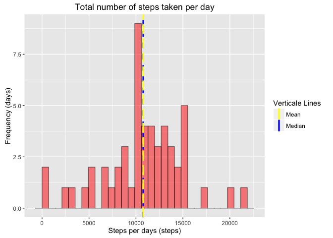
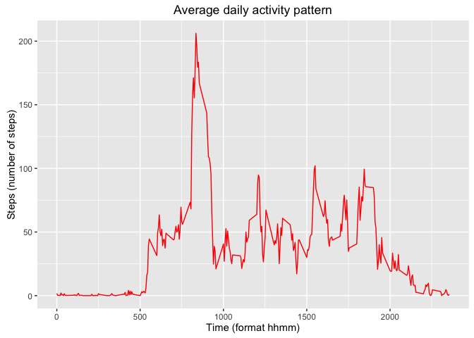
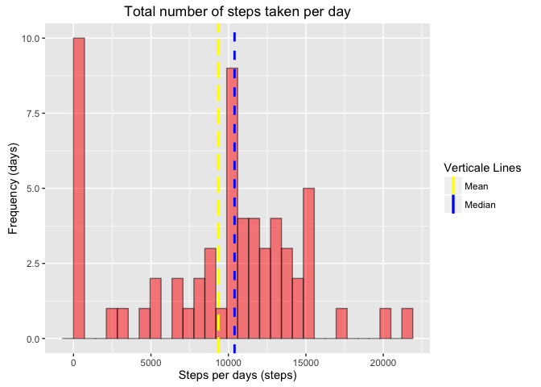
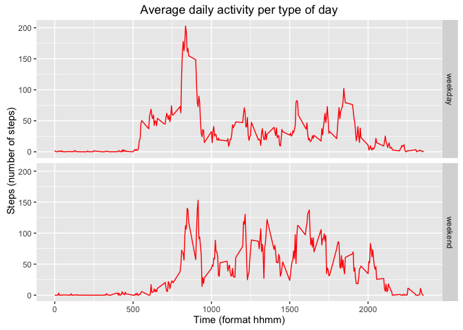

# Reproducible Research: Peer Assessment 1


The R markdown contains the answer of the Peer Assessment 1 from the Johns Hopkins Reproducible Reasearch courses.  
This file can be found in the github repository [mtarantino/RepData_PeerAssessment1](https://github.com/mtarantino/RepData_PeerAssessment1) which was originally
forked from the repository [rdpeng/RepData_PeerAssessment1](https://github.com/rdpeng/RepData_PeerAssessment1).

## Loading and preprocessing the data

#### 1. Load the data  

Data are loaded using *read.table()*. 


```r
library(data.table)
setwd("~/Dev/DataScience/ReproducibleResearch/week2/RepData_PeerAssessment1")
activity <- read.table("activity.csv", header = TRUE, sep = ",")
```

#### 2. Process/transform the data (if necessary) into a format suitable for your analysis  

The date being intially set as a factor, this column will be converted to a date class.  
Usually, during this steps the *NA* are also processe but as this will be tackle in the section **Imputing missing values**,
we don't need to do it in during this preprocessing.

```r
# Convert dates into a date type
activity$date <- as.Date(activity$date)
```

Find below a quick summary of the data from the activity table  

```r
summary(activity)
```

```
##      steps           date               interval   
##  Min.   :  0    Min.   :2012-10-01   Min.   :   0  
##  1st Qu.:  0    1st Qu.:2012-10-16   1st Qu.: 589  
##  Median :  0    Median :2012-10-31   Median :1178  
##  Mean   : 37    Mean   :2012-10-31   Mean   :1178  
##  3rd Qu.: 12    3rd Qu.:2012-11-15   3rd Qu.:1766  
##  Max.   :806    Max.   :2012-11-30   Max.   :2355  
##  NA's   :2304
```

```r
str(activity)
```

```
## 'data.frame':	17568 obs. of  3 variables:
##  $ steps   : int  NA NA NA NA NA NA NA NA NA NA ...
##  $ date    : Date, format: "2012-10-01" "2012-10-01" ...
##  $ interval: int  0 5 10 15 20 25 30 35 40 45 ...
```

## What is mean total number of steps taken per day?

#### 1. Calculate the total number of steps taken per day  
To calculate the mean total number of steps taken per day we need to aggregate the data per day (Note: At the moment, we will ignore the missing values from the dataset.).

```r
library(dplyr, warn.conflicts = FALSE)
library(ggplot2)
library(scales)

# Filter the NA, aggregate per days, sum steps 
activity_day <- activity %>%
  filter(!is.na(steps)) %>%
  group_by(date) %>%
  select(date, steps) %>%
  summarize(steps = sum(steps, na.rm = TRUE))
```
#### 2. If you do not understand the difference between a histogram and a barplot, research the difference between them. Make a histogram of the total number of steps taken each day

```r
# Plot historgramm
ggplot(activity_day) +
    ggtitle("Total number of steps taken per day") +
    geom_histogram(mapping=aes(x=steps), fill="red", colour ="black", bins = 30, alpha=.5, position="identity") +
    geom_vline(aes(xintercept=median(steps, na.rm=TRUE), color="Median", linetype="Median"), size=1, show.legend=TRUE) +
    geom_vline(aes(xintercept=mean(steps, na.rm=T), color="Mean", linetype="Mean"), size=1, show.legend=TRUE) +
    scale_colour_manual(name="Verticale Lines", values=c(Median="blue",Mean="yellow")) +
    scale_linetype_manual(name="Units", values=c(Median="dashed",Mean="longdash"), guide=FALSE) +
    scale_y_continuous(name="Frequency (days)")+
    scale_x_continuous(name="Steps per days (steps)")
```

 

#### 3. Calculate and report the mean and median of the total number of steps taken per day


```r
# Mean
mean(activity_day$steps, na.rm=TRUE)
```

```
## [1] 10766
```

```r
# Median
median(activity_day$steps, na.rm=TRUE)
```

```
## [1] 10765
```

As we can see on the graph the mean and the median are quiet close if we calculate the exact value we have :  
 - Mean : 10766.19  
 - Median : 10765  


## What is the average daily activity pattern?

#### 1. Make a time series plot (i.e. type = "l") of the 5-minute interval (x-axis) and the average number of steps taken, averaged across all days (y-axis)

To create the a such plot we need first to aggreage the data by step.  


```r
activity_daily <- activity %>%
  filter(!is.na(steps)) %>%
  group_by(interval) %>%
  select(interval, steps) %>%
  summarize(steps = mean(steps, na.rm = TRUE))

ggplot(activity_daily) +
    ggtitle("Average daily activity pattern") +
    geom_line(aes(x=interval, y=steps),colour = "red") +
    scale_y_continuous(name="Steps (number of steps)")+
    scale_x_continuous(name="Time (format hhmm)")
```

 

#### 2. Which 5-minute interval, on average across all the days in the dataset, contains the maximum number of steps?


```r
# Maximum number of steps 
max(activity_daily$steps)
```

```
## [1] 206
```

```r
# 5-minutes interval
activity_daily[which.max((activity_daily$steps)),]$interval
```

```
## [1] 835
```

```r
# Corresponding hour
paste(trunc(activity_daily[which.max((activity_daily$steps)),]$interval/100), "h", (activity_daily[which.max((activity_daily$steps)),]$interval %% 100), "min", sep="")
```

```
## [1] "8h35min"
```

As we can see in the above plot, the maximum number of steps is **206.17** and this is happening at the 5-minutes interval **835** corresponding to the time  **8h35min**


## Imputing missing values

Note that there are a number of days/intervals where there are missing values (coded as NA). The presence of missing days may introduce bias into some calculations or summaries of the data.

#### 1. Calculate and report the total number of missing values in the dataset (i.e. the total number of rows with NAs)

Looking at the activity data set, we can identify NA using *is.na()* function


```r
# Number of entry with steps set to NA
sum(is.na(activity$steps))
```

```
## [1] 2304
```

#### 2. Devise a strategy for filling in all of the missing values in the dataset. The strategy does not need to be sophisticated. For example, you could use the mean/median for that day, or the mean for that 5-minute interval, etc.

To fill the NA, we're going to replace them with the mean for that day. We need first to create a dataframe containing the mean per day.


```r
activity_day_mean <- activity %>%
  filter(!is.na(steps)) %>%
  group_by(date) %>%
  select(date, steps) %>%
  summarize(steps = mean(steps, na.rm = TRUE))
```

#### 3. Create a new dataset that is equal to the original dataset but with the missing data filled in.

As describe above, we will use the mean step of that day to fill the NA. In case there are no data for the specific day, we will replace the value with 0.


```r
activity_na_fill = activity

# loop over the data.frame
# Note : With looping beeing an expensive operation, there is most probably a better
# way to do that than looping over the dataset
for(i in 1:dim(activity_na_fill)[1]) {
    # identify the NA
    if(is.na(activity_na_fill[i,"steps"])) {
        # identify the corresponding entry with the same date from the daily activity_daily_mean dataframe
        tmp_row = activity_daily[activity_day_mean$date == activity_na_fill[i,]$date,]
        # if there is no entry for that day set it to 0
        if(dim(tmp_row)[1] == 0) {
            activity_na_fill[i,"steps"] = 0
        # otherwise set the value of the mean of that day
        } else {
            activity_na_fill[i,"steps"] = tmp_row$steps
        }
    }
}
```

#### 4. Make a histogram of the total number of steps taken each day and Calculate and report the mean and median total number of steps taken per day. Do these values differ from the estimates from the first part of the assignment? What is the impact of imputing missing data on the estimates of the total daily number of steps?

To create the histogram we will used the previous code from the first section of the assignement. 


```r
activity_na_fill_day <- activity_na_fill %>%
  filter(!is.na(steps)) %>%
  group_by(date) %>%
  select(date, steps) %>%
  summarize(steps = sum(steps, na.rm = TRUE))

# Plot historgramm
ggplot(activity_na_fill_day) +
    ggtitle("Total number of steps taken per day") +
    geom_histogram(mapping=aes(x=steps), fill="red", colour ="black", bins = 30, alpha=.5, position="identity") +
    geom_vline(aes(xintercept=median(steps, na.rm=TRUE), color="Median", linetype="Median"), size=1, show.legend=TRUE) +
    geom_vline(aes(xintercept=mean(steps, na.rm=T), color="Mean", linetype="Mean"), size=1, show.legend=TRUE) +
    scale_colour_manual(name="Verticale Lines", values=c(Median="blue",Mean="yellow")) +
    scale_linetype_manual(name="Units", values=c(Median="dashed",Mean="longdash"), guide=FALSE) +
    scale_y_continuous(name="Frequency (days)")+
    scale_x_continuous(name="Steps per days (steps)")
```

 

```r
# Mean
mean(activity_na_fill_day$steps, na.rm=TRUE)
```

```
## [1] 9354
```

```r
# Median
median(activity_na_fill_day$steps, na.rm=TRUE)
```

```
## [1] 10395
```

As we can see, both mean and median as been impacted by the changes, those numbers are lower that the previous one.  
 - **Mean fill NA** : 9354.23 / **Mean** : 10766.19  
 - **Median fill NA** : 10395 / **Median** : 10765  

This might is most probably due to the *NA* replaced with a 0 when no data for that day was available.

## Are there differences in activity patterns between weekdays and weekends?

#### For this part the weekdays() function may be of some help here. Use the dataset with the filled-in missing values for this part.  

Create a new factor variable in the dataset with two levels – “weekday” and “weekend” indicating whether a given date is a weekday or weekend day.  

```r
# Set all week day to weekday
activity_na_fill$type = "weekday";
activity_na_fill[weekdays(activity_na_fill$date) %in% c("Saturday","Sunday"),]$type = "weekend";
```

#### Make a panel plot containing a time series plot (i.e. type = "l") of the 5-minute interval (x-axis) and the average number of steps taken, averaged across all weekday days or weekend days (y-axis). See the README file in the GitHub repository to see an example of what this plot should look like using simulated data.  

Find below the plots showing the time series plot of the 5-minutes interval and the average number of steps. The plot has been divided into 2 sections for the week days and the week end.


```r
activity_na_fill_daily <- activity_na_fill %>%
  group_by(type, interval) %>%
  select(type, interval, steps) %>%
  summarize(steps = mean(steps, na.rm = TRUE))

ggplot(activity_na_fill_daily) +
    ggtitle("Average daily activity per type of day") +
    facet_grid(type ~ .) +
    geom_line(aes(x=interval, y=steps),colour = "red") +
    scale_y_continuous(name="Steps (number of steps)") +
    scale_x_continuous(name="Time (format hhmm)")
```

 
